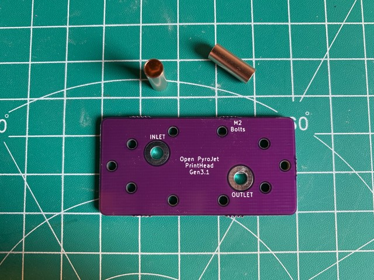
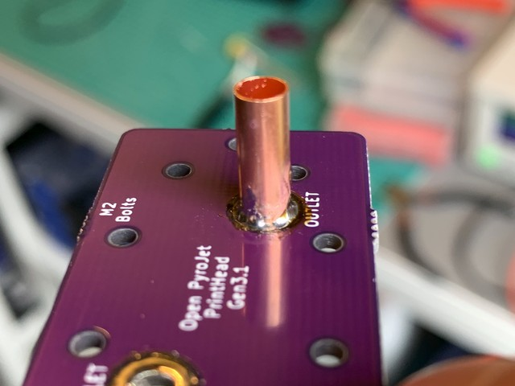
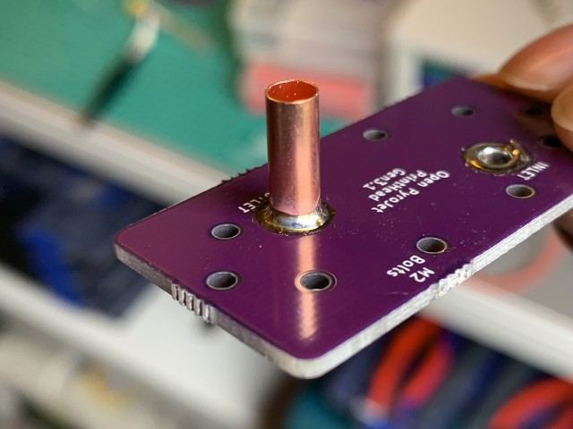
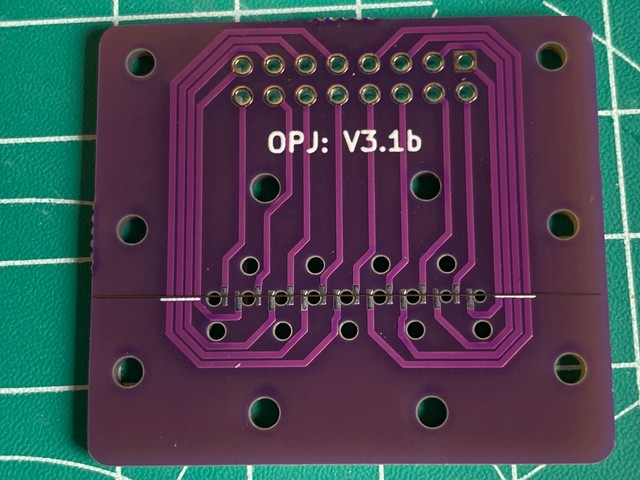
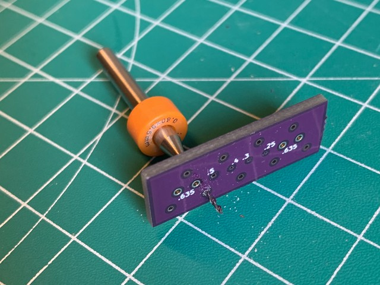
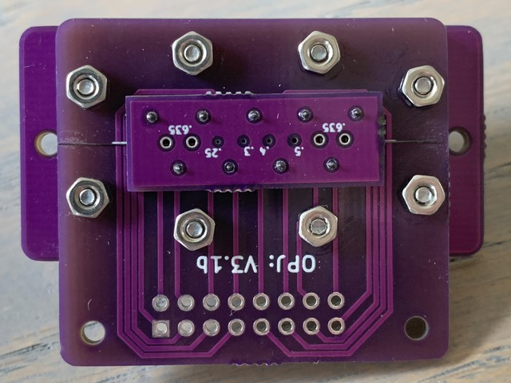
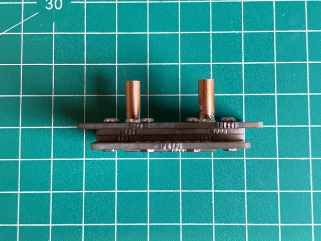

!!! Warning

    This is an experimental project. There is a risk of hurting yourself and/or damaging property when trying to implement or replicate the hardware and/or software. Doing so is completely at your own risk. Take note of our safety guidelines, but don't consider them comprehensive or complete.

This page shows you how the `Gen 3.1` print head prototype was assembled. This is what the finished print head looks like:

To build a strong print head, multiple layers made from PCBs are used.
These layers are stacked in the order as they are laid out below:

First, the inlet and outlet are prepared. To connect Viton tubing to the print head, small copper pipes (`3 mm` diameter) are soldered to the PCB.
The picture shows a larger copper pipe, because the wrong size was used when taking pictures:

Solder was applied to the pads first:

Initially, the solder doesn't want to connect neatly all around the copper pipe. The picture below shows the result of that. Some extra solder was used and placed on such locations. Flux would've probably helped too.

Smudges are another problem that might occur while soldering.
It cleaned it off by wiping the (cleaned) soldering iron on it.
It's not problematic if there is some solder on the side,
but I have to make sure it's not sharp.
That way, it won't cut the Viton tubing later on:

Finally, there is a neat collar on the copper pipe:

The next step is to put the monofilament on one of the PCB layers. This monofilament
is what heats up the fuel, which causes the fuel to eject through the nozzle.
The filament gets sandwiched between the nozzle PCB and the PCB that holds the connector.
The filament can be stored in a folded sheet of paper:

The filament is cut to size. It's good to make it as wide as possible, so it's easier to control and so that we can tape it down on the sides.

Combining the PCBs is tricky, because the filament won't lay still on a flat surface.
In the picture, glue is used to keep the filament in place. In the future, a piece of tape (e.g. Kapton tape) will be a better alternative.

The nozzle PCB layer had holes that were too small in diameter. They were widened them
by hand with some cheap drills, slowly increasing the diameter `0.1 mm` at a time:

A single row of screws combine the two PCB layers. They are not tightened yet:

Tightening is done carefully and as evenly as possible. When everything stops sliding
around, resistance measurements are done before continueing to tighten further.
The resistance measurements are repeated until the values are in an acceptable range.

The nozzle plate should be placed straigth, unlike in the picture below. In the future, a 3D printable guide will be developed to combine the 2 PCBs with proper alignment.

The prepared PCBs are ready to be combined. I took 8 pieces of `M2 x 10mm` and
some `M2` nuts to match. Medium-strength loctite was also used:

At this point, I have a finished physical assembly:

