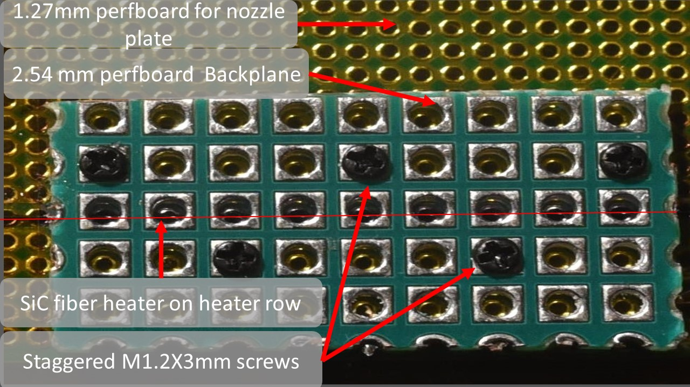
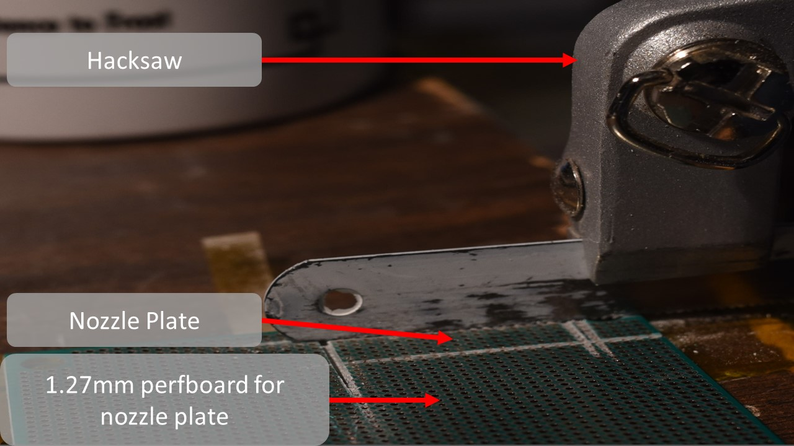

!!! Warning

    This is an experimental project. There is a risk of hurting yourself and/or damaging property when trying to implement or replicate the hardware and/or software. Doing so is completely at your own risk. Take note of our safety guidelines, but don't consider them comprehensive or complete.

# Getting Started
This section is a visual guide to assembling a 48 DPI (~500 micron dot size) 8 nozzle pyrojetprint head, using nothing but off the shelf parts and basic hand tools.
The specifications of the finished print head are thus:

- 8 channels, 4 anodes, 4 cathodes

- heater room temperature resistances(RTR) between 10-100 Ohms, generally clustering around 20-50 ohms

- Negative temperature coefficient of resistance (NTCR) of ~5.2E-4 Ohm / K

- maximum pulse energy tolerance of 1.2 joules, maximum drive voltage, 50 Volts, maximum drive current 500 milliamps. Element is intended to ramp from room temperature to 1900 K in <= 10 milliseconds.

- Heating element material: graphite carbon core Silicon carbide CVD monofilament, 0.135 mm diameter.  0.03mm carbon core diameter. Resistivity of 0.05 Ohm * cm, 2E-4 Ohm * m.

- Board and manifold material : FR4 glass epoxy prepreg board with copper-nickel plated through holes. Inlet and electrical lead side 2.54 millimeter pitch with 1.2mm diameter holes, 2.0 mm wide square pad contacts concentric to holes. Nozzle plate, round 0.635mm diameter holes on 1.27mm pitch, secured to 2.54 mm pitch board with self tapping m1.2 black oxide screws.

- Print head must support capacitive touch sensing, temperature monitoring of the heating elements, and IV signal monitoring in the nozzles.

- Should be cheap, costing less than 2 USD / printhead.

- needs to be scalable to large numbers of nozzles over a large area, and to small feature sizes (small nozzle and heater widths) and thus high cycling frequencies.

- Should be designed to minimize heat loss from the heating element, and from the combustion in the nozzles, this prevents flame quenching and excessive power consumption as we scale down feature size.

## Scope
Before you get started you should know that this document is only for the most basic of print heads obtainable with off the shelf parts and materials. This is intended as a very simple first step into the pyrojet project, and towards building your own pyrojet printer.

You will require a few basic hand tools, such as a hack saw and precision screw driver. The materials for the print head can be a bit odd to source, such as FR4 plated through hole perf boards on 1.27mm pitch, and the of course the silicon carbide monofilament that is the heating element. Unfortunately, it is one of the vey few materials, commercially available that can do the job and do it well.

Other heating element materials, such as graphite, kanthal, nichrome, platinum, stainless steel, generally do not have high enough resistance to attain the thermal ramp speed required of the heating element, and/or lack the oxidation resistance, hot creep strength and high melting point (>3100 K ) required to survive repeated exposure to stoichiometric hydrocarbon combustion and molten metal particles..

If you do find another material better suited and more widely available (some kind of oxygen resistant graphite? maybe tungsten carbide? Zriconia wire? Molybdenum disillicide wire?) do not hesitate to make it known and use it!

## Graphical Assembly Guide

### Step 1: Preparing the backplane

Cut out a piece of the 2.54mm pitch PCB. You could use a bandsaw, keyhole saw, jewelers saw, or other implements. There are many kinds of perfboard available. Square pads are less common but do exist, and help greatly in alignment in later steps.

Mill/saw out a rectangular piece of the 2.54mm perfboard, 11 holes long, by 5 holes wide. Approximately, 29 mm long, by 15 mm wide.  Try to keep your cuts as straight as possible.

The backplane will have rough edges and may require sanding or lapping. You can use fine grit sand paper and side cutters or a razor blade to trim the rough edges, or simply smooth it down against a piece of ceramic, like aluminum oxide sheets as shown below.

Lap the rough cut edges of the back plane to make sure it will fit nicely on the nozzle plate. Be sure to dunk the backplane 99% IPA or a similar cleaning agent to remove dust and oil after lapping.

For the next step, grab a fine point sharpie, and 1.27mm pitch perfboard(for nozzle plate), and align the holes in the 2.54mm backplane with holes in the 1.27mm perfboard. Make sure there is some margin in the 1.27mm perfboard around your aligned 2.54mm backplane.

Place the freshly cut, lapped and cleaned backplane onto the 1.27mm pitch perfboard, aligning the holes of each board.
Mark the position with a fine point sharpie, and mark the location of the heater row on the nozzle plate as well.

### Step 2: Installing The Heating Element

Once you have the location marked and the backplane aligned and resting on the nozzle plate, get your silicon carbide monofilament of choice. Mine is a specialty materials, SCS-6 standard 0.135mm carbon core 3C, beta silicon carbide CVD derived monofilament.

Remove the backplane from the nozzle plate and prepare to align a piece of the filament with the row you marked on the nozzle plate previously to denote where your center row (heater row) is located.

Just above where you made your heater row mark, place a piece of Kapton tape, being careful not to cover the row of holes in the 1.27mm perfboard where your heater row goes.

Place another piece of Kapton along the bottom edge of the 1.27mm perfboard, just below your heater row mark as shown, to secure the nozzle plate to your work surface and provide alignment of the filament as well as preload between the nozzle plate and the backplane.

Lay the silicon carbide monofilament along the heater row as shown, between the pieces of Kapton tape.  

Secure the filament to the 1.27mm pitch perfboard nozzle plate and across the heater row with  Kapton tape, perpendicular to the other two pieces of Kapton as shown.

### Step 3: Installing The Backplane And Clamping The Heating Element

Find your M1.2X3mm self tapping screws and precision screw driver…

Lay your backplane gently across your now tapped down silicon carbide monofilament heating element, being sure to align every other hole in the nozzle plate, with each hole in the backplane, and extract a M1.2 X 3mm self tapping screw from the box.  

Firmly press and screw the  m1.2 X 3mm screw into one one of the aligned holes, preferable one at the far left corner of the backplane closest to the edge.  It should bite and screw in easily. Tighten it until it is firm and snug, and resists further turning. But no tighter.

Repeat this fastening process, being careful to stagger the screws and install them adjacent to the heater row, so that no two are on the same column. This will make soldering easier later, and ensures a uniform clamping force on the heating element which provide consistent electrical and thermal contact.

Set your multimeter to the 200 Ohm setting, and probe each pair of adjacent contacts along the heater row on the now secured backplane.
Go back and tighten the screws until all the heater resistances read between 10 and 100 ohms. If all your screws are tightened evenly, all the resistances should cluster between 20 and 50 ohms. Optimal resistance for the heaters in this design is 22 Ohms.

### Step 4: Releasing The Printhead

You may now use your hack saw, or mill to carefully release the print head assembly from the nozzle plate stock, if you did not cut the nozzle plate out separately…
This will be done by cutting flat through the surface of the 1.27 mm perfboard stock as shown…

Cutting through the 1.27mm perfboard is quite tough. It takes some patience and a sturdy work surface. A clamp or other work piece holder can help, though it is possible to perform the release entirely by hand.

You may find that pieces of the nozzle plate stock 1.27mm perfboard break off as you saw through it. Stop once you can see the 2.54 mm perfboard back plane showing. Be sure to leave the 2.54 mm perfboard excess material around the nozzle plate, to use as a flange for later.

After perhaps 10 minutes of steady work, you should end up with something like what you see in this image of the released print head. Each active nozzle (every other hole in the 1.27 mm perfboard nozzle plate) is ~0.635 mm in diameter and ~1.6 mm deep.  Each is plated with copper and nickel which serves as a thermal barrier coating.

Take note of the heater and nozzle locations. Each heater formed by the contacts of the 2.54 mm pitch perfboard pressing against the silicon carbide monofilament, create heaters that are cylindrical and have dimensions of ~0.5mm long X 0.135mm diameter.

### Step 5: Packaging and Back Contacts Soldering

Once you have your completed print head chip, and have identified the back contact locations, grab a set of 9, separately colored 0.1” jumper pins, and leave them glued together to make a homemade color coded ribbon cable.

Use a pair of needle nose pliers to bend the pins, at one end of your “ribbon cable” to 90 degree “L” shapes. Alternatively, you may create solder jumpers across the contacts of the backplane on it's backside.

Solder the freshly bent “L” shaped jumper pin ends of the ribbon cable to the back contacts (the 2.54mm pitch perfboard plated holes we identified earlier in slide 27 and 28). This could take some time, it is a tight job, and can be frustrating. Take your time, take breaks and try not to breath too much solder. A fine tip soldering iron, and some fine solder wire helps.

When finished your jumpers should have their insulated black thermoplastic end covers inside the perimeter of the print head back plane. Like the image to the right otherwise it may not fit into the reservoir and package very well…

The last step is to coat the edges of the print head chip in a two part epoxy or superglue, and press it into the hole in the bottom of the 3D printed reservoir and creality ender 3 compatible package. Be careful not to get the epoxy up onto the nozzle plate, and try to keep it on the flange of the backplane as much as possible.

Here are some short clips of the printhead actually firing, fueled by naptha(white gas/coleman gas) and about 23 watts of peak electrical pulse energy , @ 31 Volts, 0.75 A .

- You are encouraged to invent your own packaging and connection schemes. If you want to save time and are willing to pay a small price for a more reliable product, [panelized PCB based printhead designs](https://github.com/Sindry-Manufacturing/OpenPyroJet-Electronics/tree/master/Gen3.1_Printhead) are available on the github. Courtesy of Paul (Parkview785).

- [Driver electronics and a controller board](https://github.com/Sindry-Manufacturing/OpenPyroJet-Electronics), (an experimenters board) also by Paul can be found here:

Adjoining firmware, UI and web-app interface can be found here, courtesy of Ken (Hayland).
- [Firmware](https://github.com/Sindry-Manufacturing/OpenPyrojet-Jetpack)
- [web-app interface](https://github.com/Sindry-Manufacturing/OpenPyrojet-Jetpack.js)

If you have any questions, feel free to ask them in the discord assembly support page!
- [Discord Community](https://discord.gg/HPmfeezRct)
