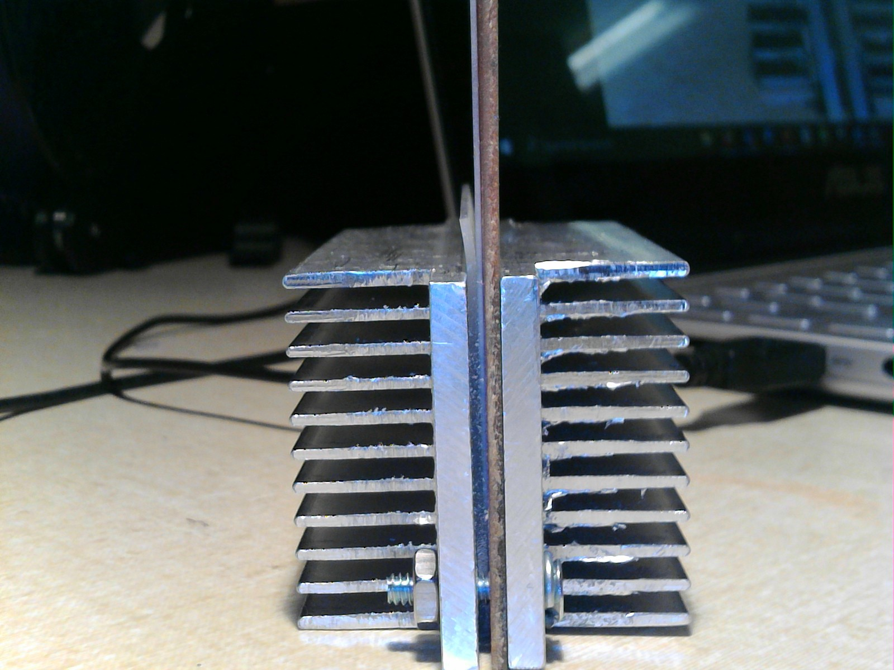
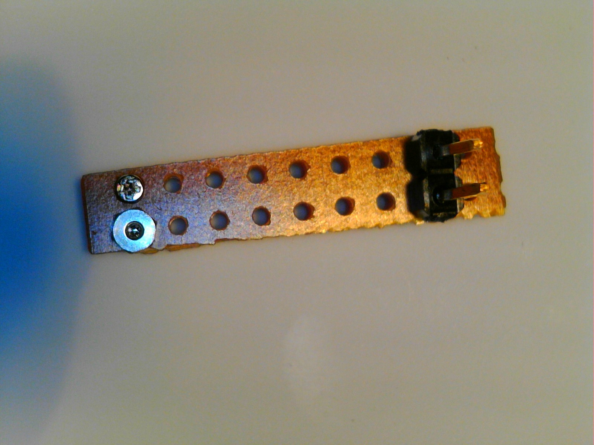
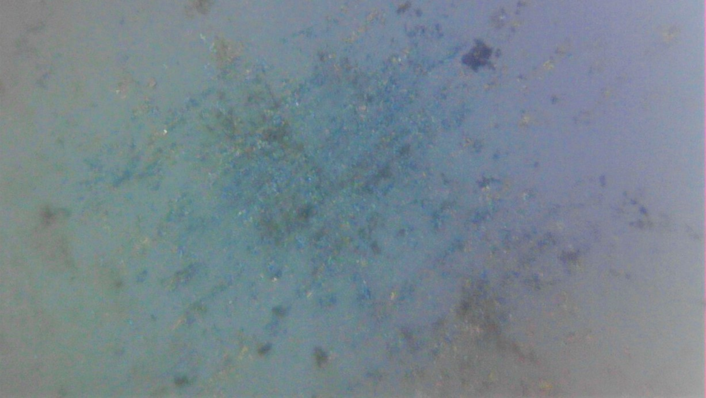
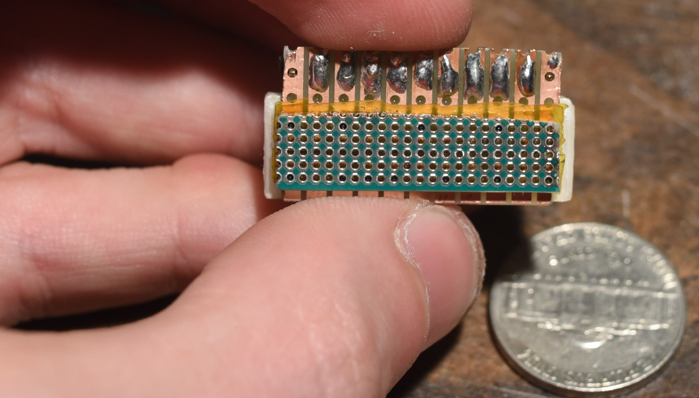
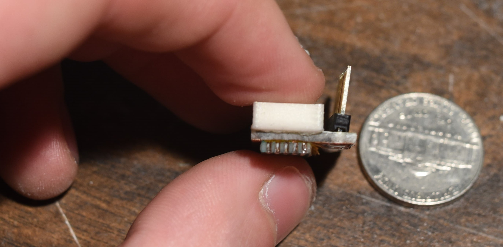

#The History of Pyrojet to Date

## Generation 0 Printheads  
A brief clip from the youtube channel of [gen 0](https://www.youtube.com/watch?v=ZMwwS9Hqgkw&ab_channel=OpenPyrojet) flashing bright white in response to an applied voltage from a manually operated DC power supply supply.

Generation 0 is perhaps not deserving of a generation designation as it was assembled literally from garbage around the lab and a piece of sample material I acquired largely on a whim. I had been searching for cheaper more effective ways of making very high performance [microheaters](https://en.wikipedia.org/wiki/Microheater) (small heating elements) capable of obtaining and maintaining temperatures in excess of 1300 K, starting from room temperature, in air, and doing so in ~1-10 milliseconds time scale, with power consumption that could be supplied by a commmon benchtop DC power supply, typicaly peak pulse powers no more than 50 watts.  

 By taking two, 50mm square X 1mm thick aluminum oxide substrates, that had silver palladium traces screen printed onto them, in lines 0.25 mm wide X 0.15mm apart, and pinching a piece of [silicon carbide monofilament](https://www.specmaterials.com/silicon-carbide-fiber-1) between them I was able to demonstrate very responsive and white hot (>1300 K) temperature ramp of a few such silicon carbide segments bridging the leads on the aluminum oxide, by manually activating and deactivating a DC power supply. This was essentially when I(thought I) figured out how to build the heaters we would need to make pyrojet work, without a CMOS foundry or a clean room using commercially available off the shelf materials. All subsequent designs have derived a similar clamping filament mechanism as their core feature. this enables very high performance microheaters to be built, which can tolerate the conditions of combustion and detonation we would need for pyrojet to work.

 The [thermal shock](https://en.wikipedia.org/wiki/Thermal_shock) load the filament creates on the underlying ceramic substrate, results in their subsequent fracture after a small(10-100), somewhat unpredictable number of cycles, probably due to thermal fatigue stress cracking when the temperature gradient exceeds the thermal endurance of the material. Perhaps the use of quartz, enameled steel or LTCC substrates could overcome this limitation, but at great expense. I never found their performance to be much better personally. Further, other issues I encountered with ceramic substrates were their sensitivity to fracture under point loading, and the difficulty of actually clamping them in such a way that they would not fracture while pressing against the silicon carbide monofilament, which represents a relatively sharp, hard object and thus concentates clamping stesses at its small contact surface with the ceramic.  

 A good starter on some of the issues with ceramic materials, despite their high temperature tolerance can be found in this [paper on fracture in brittle materials](https://www.researchgate.net/profile/Tanja-Lube/publication/285988680_Fracture_of_Ceramics/links/56ab70c608aed814bdea19a9/Fracture-of-Ceramics.pdf?origin=publication_detail)

## Generation 1 Printheads  
 A brief clip of [gen 1](https://www.youtube.com/watch?v=odwthtkt_Ac&ab_channel=OpenPyrojet) boiling water through its "nozzle", the little channel between the strips on the strip board...Also, flashing bright orange from a manually operated DC power supply.  

  

Generation 1 was an attempt to improve on and scale up the generation zero design by replacing my thumbs with a soft silicone pad and a pair of rigid aluminum heatsinks to hold the filament against a set of copper leads. the electrical connections were provided this time, by a piece of [FR-2](https://en.wikipedia.org/wiki/FR-2) [strip board](https://en.wikipedia.org/wiki/Stripboard). FR-2 has better thermal mechanical endurance than ceramic materials by several orders of magnitude, and is far more insulating, which I hoped would improve the energy efficiency of the design, in spite of the much longer heaters, determined by the 0.5mm spacing between the copper strips on the strip board.  Additionally, the FR-2, being a relatively compliant and flexible material made it much easier to establish consistent electrical connection to the silicon carbide monofilament. The relative flexibility of FR-2 allowed the electrical leads to compliantly adjust to the total clmaping force applied and establish connection to the monofilament heating element despite surface flaws or non flatness of the underlying assembly components.  Additionally, FR-2, being composed typically of a material like [Novolak](https://en.wikipedia.org/wiki/Novolak), reinforced with matts of a [fire retardant cotton](https://en.wikipedia.org/wiki/Fire-retardant_fabric) essentially behaves like an [apollo era heat shield material](https://en.wikipedia.org/wiki/AVCOAT), in that, it pyrolyzes(oxidizes without ignition, and without supporting a flame of its own) and in doing so becomes more resistant to further pyrolysis, while retaining its underlying shape and structure.

  

Generation 1 has a great deal in common with the design of [thermal print heads](https://en.wikipedia.org/wiki/Thermal_printing). It may actually make for a very high performing, very low cost, and very long lasting such thermal printhead for some enterprising individual interested in exploring such a direction.  
Perhaps we here in the pyrojet project can generate a fork for addressing the need if there is interest in a well supported open source solution to thermal printing. A much improved version of the design could be quickly fabricated from FR-4 on aluminum, which would greatly reduce the dimensions, improve the speed, power consumption and resolution, and could eliminate many assembly steps from the original process. Discussion of this sort of thing is welcome in the discord. :)

The big downfall of generation 1, was that it was too difficult to assemble as designed. Aligning all the parts repeatably, and ensuring levelness and flatness of the heating element across the width of the assembly was difficult. Further, the aluminum heatsinks are hugely overspecced for the actual peak pulse power and total dissipation. While extremely rigid, they added a great deal of unneccessary mass. Additionally, feeding material to the print head was diffcult, as the long, thin channels formed by the copper strip board were very small, and thus mostly relied on capillary action to carry water or fuel to the heating elements. Getting any particles into this would be very difficult, and designing a manifold of some kind to feed it proved quite complex. So I decided to move on to other designs, and try to simplify things.

This print head design did teach me an important lesson, that FR-2 and [FR-4](https://en.wikipedia.org/wiki/FR-4) materials are far more durable than they are often given credit for. This was an important realization into generation 2 and beyond. I learned of an old adage that was new to me, "If it can be done on FR-4, it should be done on FR-4". I like to take good advice when I can find it.

## Generation 2 Printheads  
A short clip of [gen 2](https://www.youtube.com/watch?v=TxRYmt80EEo&ab_channel=OpenPyrojet) firing a nice big plume of flame.

  

Generation 2 was a simplification from the lessons learned in generation 1. Especially taking advantage of the surprisingly good thermomechanical properties of FR-2 and FR-4. Additionally, I tried to reduce the amount of narrow channel a material feedstock solution/suspension would have to flow through to reach the heating elments by shortneing the overall assembly length and reducing the whole system to just a single heating element, and its copper leads, that is the minimum amount of strip board I needed to electrically connect to a piece of silicon carbide monofilament the width of two copper strips of the board.

  

By reducing the overall amount of hardware required to assemble a print head, I greatly reduced the cost in terms of time and resources to make them for testing. Thus, I got to run a lot more experiments for far less effort invested. I also moved from big 6-32" screws, to using M1 screws and nuts to clamp the strip boards together, because the holes in the strip board were the exact right size for M1 screws. How convenient! this elimnated the need for the aluminum heat sinks as well, as the FR-2 proved rigid enough to retain the filament reliably. With the elimination of the aluminum oxide sheet, also came the elimination of the need for the silicone pad to protect it, thus the assembly part count was reduced and the whole process was greatly simplified.

  

With the use of only one heating element, the assembly process was easier to perform, and to ensure a flat and level heating element across a proportionately smaller length. The shorter channels, and the use of two strip boards instead of just one, allowed a slightly wider channel, thus flow through was improved... but only by a small amount. The problem of clogging and poor material flow did persist frustratingly. Still, this print head design taught me much about how to simplify assembly, the utility of small screws, and the value of small desktop CNC machines. the strip boards to make the generation 2 printhead were cut on the Saismart genmitsu 3018 desktop CNC mill. It is a very handy little device for custom FR-4 work and quick and dirty prototypes.

This print head generation helped me appreciate the importance of oxygen in the combustion process at small scales. Because the heating element is practically in the open air, I believe it preheats the air in front of the exit of the channels on either side of the heating element, formed by the copper leads of the strip board, and as the fuel inside the channel vaporizes and sprays out of the exits on either side of the heating element, it meets hot air, and the hot surface of the element, and ignites. Of all the print head designs, this was the most impressive to look at up close, as the flame plumes it would produce were relatively large and bright. Additionally, this was the first generation to *actually deposit any metal at all*. Some of the earliest dots of silver printed by gen 2, on aluminum oxide substrates are shown below.

The problem with having the heating element so close to the exterior of the printhead however, is that the external combustion is quite unconfined, and so produces more of a shotgun blast than a proper dot on a surface. It is more of a molten metal spray that spatters signifigantly beyond the width of the exit channel and heating element and is not always predictable in its geometry or distribution on the surface. This is probably not desirable for 3D printing applications. Though there may be reason to revisit gen2, with some refinements in the future. Perhaps there is something more to be learned from the more external combustion approach and the lessons in design and nozzle plate construction from gen 3, 3.1 and 4.

Generation 2, expanded to inlcude a larger number of heating elements could also potentially be used to build thermal printheads on the cheap...

## Generation 3 Printheads
A short clip of [gen 3](insert youtube link here) firing with white gas (Naptha) and copper particles.

In generation 3, I opted to try a planar geometry with an actual nozzle plate to try and better constrain the combustion of fuel and subsequent deposited spots. This time, I got better quality board stock, FR-4, instead of FR-2. FR-4 typically has much better chemical resistance, and much improved temperature resistance. Rather than burning and smoldering, FR-4 tends to lose mass as CO2 gas and forms a durable graphitic carbon layer which then inhibits further ingress of heat. Basically a cleaner version of the pyrolysis process in FR-2, but with the added durability of a [E-glass](https://en.wikipedia.org/?title=E-glass&redirect=no), reinforcing phase instead of just paper or cotton fibers, and with a halogenated [PMMA](https://en.wikipedia.org/wiki/Poly(methyl_methacrylate)) or [Co-polyester](https://en.wikipedia.org/wiki/Copolyester) matrix. Which greatly increases the specific heat and mechanical properties retention at elevated temperature, and reduces the thermal conductivity of the material beyond conventional novolak, or bakelite resins. These improvements greatly enhanced the durability and lifetime of the printheads in use. Soldifying the choice of FR-4 as a material in future print head designs. It is cheap, durable, and actually very heat and chemical resistant. An excellent middle ground in performance, and a minimum in cost between [ceramics](https://en.wikipedia.org/wiki/Ceramic), [polymers](https://en.wikipedia.org/wiki/Polymer) and [glasses](https://en.wikipedia.org/wiki/Glass).

In this design, I hyrbiized a few different choices from prior designs. Using a [ST3-U standard FR-4 strip board](http://www.busboard.com/ST3U) for a electrical contact plate, a [1.27mm pitch perfboard](http://www.proto-advantage.com/store/product_info.php?products_id=200069) for a nozzle plate, and the same M1 size self tapping screws from gen 2, and with a 3D printed PLA inlet manifold for connection to a syringe for feeding solutions and suspensions of fuel and particles and other feedstocks for testing.  

  

This version of the printhead took advantage of the fact that 1.27mm pitch is exactly half of 2.54mm pitch. this meant, that every other hole in the perf board, lined up with ever hole in the strip board, allowing for a screw to be inserted through both, whil leaving one hole between every pair of holes open on one end, and closed by the region between the strips of the strip board on the other. Effectively, this formed a combustion chamber, where fuel would enter from the sides, via two narrow channels, about as tall as the silicon carbide filament diameter (which was clamped between the perfboard and strip board to form the heating elments in each nozzle) at the top, and then when burned, would leave through the open end of the .635mm diameter via in the 1.27mm pitch perfboard.  

While this printhead turned out not to perform all that well for depositing metal, it jets liquids and fire from fuels quite effectively and probably represents one of the cheapest and simplest ways of building an [inkjet](https://en.wikipedia.org/wiki/Inkjet_printing) style print head without the need for a CMOS foundry. If you are interested in this kind of technology, this may be of some service to you and may be a direction we look for forks of the project in the future. Inkjet technology really should be more accessible. It is very useful for a great many things, including [multi jet powder bed fusion technologies](https://en.wikipedia.org/wiki/3D_printing_processes#Binder_jetting), [uv cured resin jetting](https://en.wikipedia.org/wiki/3D_printing_processes#Material_jetting), and a variety of other approaches which have largely been inhibited by the limitations of the availability and performance of well supported open source inkjet print head technologies.
Prior open source projects, such as the [Inkshield](http://nerdcreationlab.com/projects/inkshield/) have suffered from similar limitations, that is, that the underlying limited performance and availability of printheads negatively impacted the scalability of the project. Though it produced some excellent results none the less, and some very useful basis knowledge for the operational theory of inkjet and inkjet like systems. The fully open source driver circuitry is also an excellent point of reference.

Perhaps one could use generation 3's ability to spit plumes of concentrated flame reliably, when fed with ethanol and nitromethane or ethanol and glycerol, or white gas, to sinter powder in a powderbed directly and with precision comparable to a laser but fully in parallel? It is a thought I have considered but have not chosen to pursue due to the dangers and frustrations of open powder beds. It may be of some service to other enterprising individuals in the future. One imagines an inkjet like print head, shooting little gouts of ethanol torch flame to melt plastic,metal,and ceramic powder, at a tiny fraction of the cost of a laser, and with much greater speed thanks to the parallel multinozzle nature of an inkjet like print head.

Some lessons learned from generation 3, is that perfboards allow far too much blowby, due to their large number of extraneous holes to be practical as nozzle plates for proper detonation spraying, when a detonation occurs in one nozzle, it disturbs the fuel in essentially all the surrounding ones, even several nozzles away! A complete nozzle plate, with holes only where they are needed, and with completely separate mounting holes is preferable. Also, [better inter-nozzle sealing(a head gasket of sorts)](https://en.wikipedia.org/wiki/Head_gasket) is desirable, though still being worked on. Further, 3D printed PLA, is neither heat, nor chemical resistant enough to be part of a pyrojet printhead for any real extended use. Thus, with much help from Paul(basically all of the design work) and Ken(basically all of the software at the time) and some others, it was decided to make the next version, gen 3.1 via fabrication at JLPCB with all FR-4 components and soldered copper inlets and outlets for the manifold. For safety, and for quality.

## Generation 3.1 Printheads  
[gen 3.1](https://www.youtube.com/watch?v=MGj6DS3kkq8&ab_channel=OpenPyrojet)

Images of gen 3.1 can be found at the most recent assembly guide page on the website here. It demonstrated the superiority of an all FR-4 print head design, made by a professional board house, and the incredible time and cost savings such an operation enables if we can stick to more or less their standard feature and manufacturing limitation set. Paul and Ken were full of sound advice, and lent much of their skill and experience through the process.

This print head taught us to minimize the number of fasteners, that the air gap, while important does not neccessarily have to be micrometric, and wasthe first print head to be tested with continuous flow loops by peristaltic pump and with other proper desktop printer integration elements. 

## Generation 4 Printheads  
This is the most recent version, for which an assembly guide is not yet available. It integrates lessons from all the previous generations and will hopefully offer perfromance commensurate with such learning soon. Keep coming back for updates on the progress, here on the website, on [Discord](https://discord.gg/HPmfeezRct) and on the [Pyrojet youtube channel](https://www.youtube.com/channel/UCBE1bfTLnz7WSu8h5rG6ihA)!
